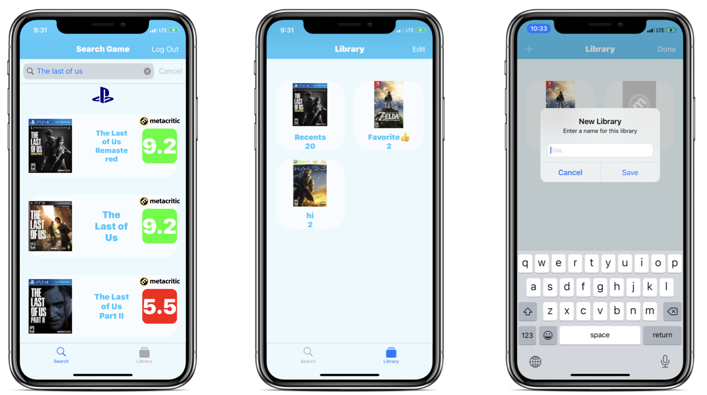

# GameTodoey
    

  
[Download Link](https://apps.apple.com/kr/app/gametodoey/id1507663102?l=en)  
  
## Summary  
iOS app which allows users to search play-time and user-rating for video games.  
This app provides following informations with simple search.  
* User rating  
* Length of game for main story, main+extra contents, perfect completion of the game.  
* Summary of game  
   
## Data Source  
This app crawls data from following websites. 
* [Metacritic](https://www.metacritic.com/)
* [HowLongToBeat](https://howlongtobeat.com/)  
  
## Sample App Screenshot  
  
  
## libraries  
[Podfile](https://github.com/JaeguKim/GameTodoey/blob/master/Podfile)  
